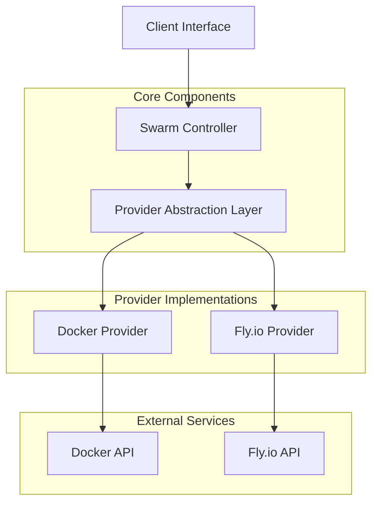
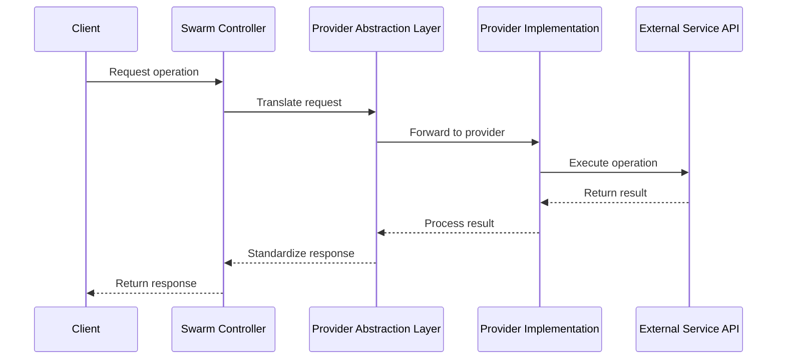
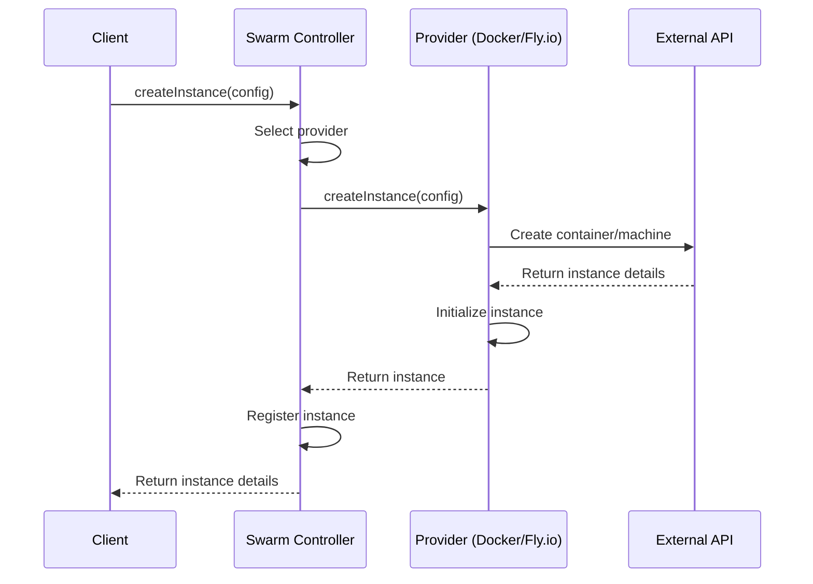
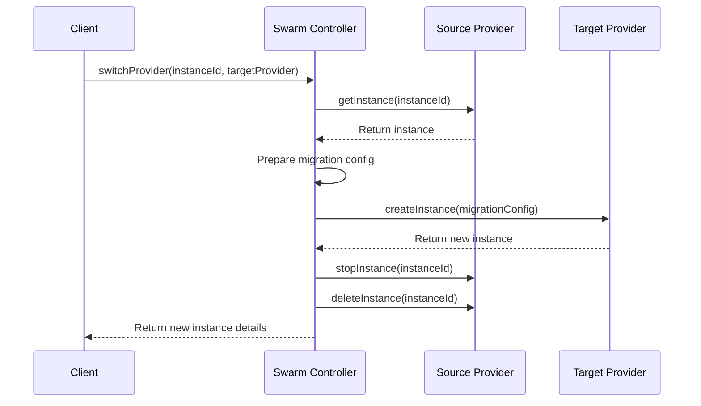
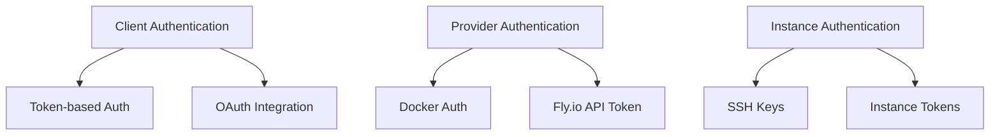
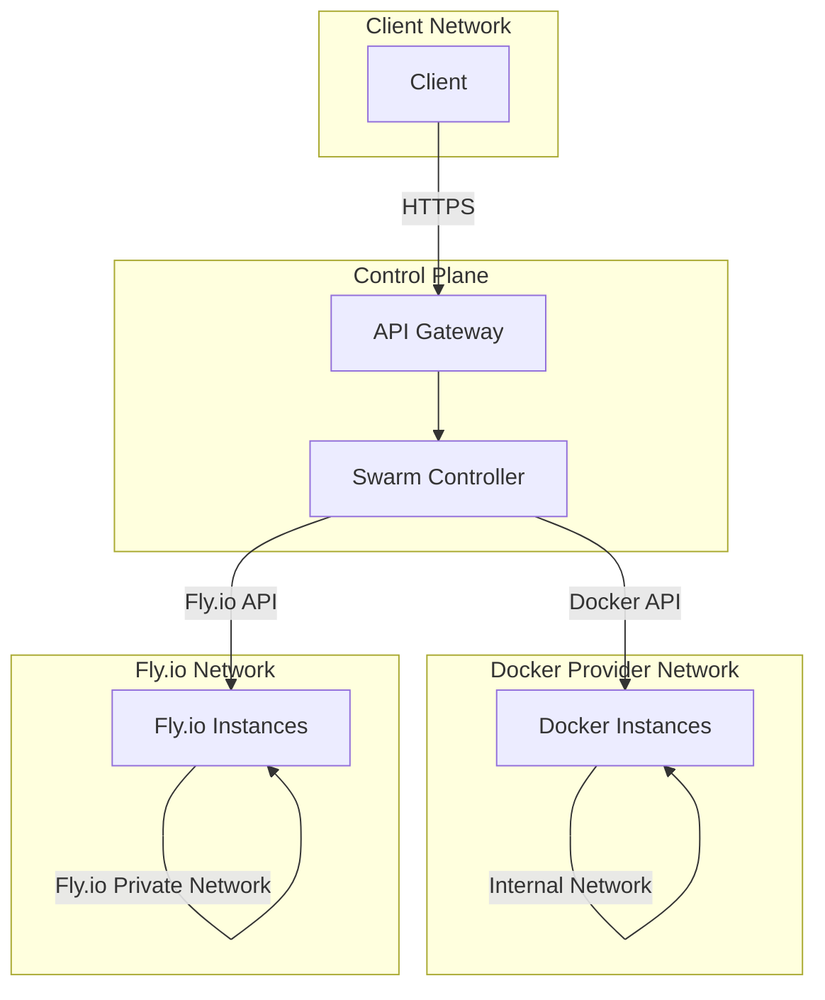
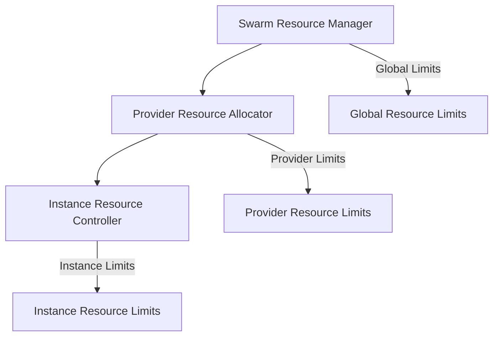

# VSCode Remote Swarm: Architecture Design

## 1. Introduction

This document outlines the architecture for extending the VSCode Remote system to support both local Docker and remote Fly.io deployments. The design focuses on creating a flexible provider abstraction layer that allows seamless switching between deployment environments while maintaining backward compatibility with existing functionality.

### 1.1 Goals

- Support both local Docker and remote Fly.io deployments
- Create a provider abstraction layer for deployment environment switching
- Maintain backward compatibility with existing functionality
- Design clear interfaces and communication flows
- Establish robust authentication, networking, and resource allocation

### 1.2 Key Concepts

- **Provider**: An abstraction that handles deployment-specific operations
- **Instance**: A running VSCode environment (container or Fly.io machine)
- **Swarm**: A collection of instances managed as a unified system
- **Controller**: The central component that orchestrates the swarm

## 2. System Architecture

The VSCode Remote Swarm architecture follows a layered approach with clear separation of concerns:



### 2.1 High-Level Components

1. **Client Interface**: Provides a unified API for client applications to interact with the system
2. **Swarm Controller**: Orchestrates instance lifecycle and manages the swarm
3. **Provider Abstraction Layer**: Abstracts provider-specific implementation details
4. **Provider Implementations**: Docker and Fly.io specific implementations
5. **External Services**: Docker API and Fly.io API

## 3. Provider Abstraction Layer

The Provider Abstraction Layer (PAL) is the core architectural component that enables deployment flexibility. It defines a common interface that all providers must implement, allowing the controller to interact with different deployment environments through a unified API.

### 3.1 Provider Interface

```typescript
interface Provider {
  // Instance lifecycle management
  createInstance(config: InstanceConfig): Promise<Instance>;
  startInstance(instanceId: string): Promise<void>;
  stopInstance(instanceId: string): Promise<void>;
  deleteInstance(instanceId: string): Promise<void>;
  
  // Instance information
  getInstance(instanceId: string): Promise<Instance | null>;
  listInstances(filter?: InstanceFilter): Promise<Instance[]>;
  
  // Resource management
  allocateResources(instanceId: string, resources: ResourceConfig): Promise<void>;
  getResourceUsage(instanceId: string): Promise<ResourceUsage>;
  
  // Networking
  configureNetwork(instanceId: string, networkConfig: NetworkConfig): Promise<void>;
  getNetworkInfo(instanceId: string): Promise<NetworkInfo>;
  
  // Provider-specific operations
  executeCommand(instanceId: string, command: string): Promise<CommandResult>;
  getProviderCapabilities(): ProviderCapabilities;
}
```

### 3.2 Provider Factory

The Provider Factory creates and initializes provider instances based on configuration:

```typescript
class ProviderFactory {
  static createProvider(type: ProviderType, config: ProviderConfig): Provider {
    switch (type) {
      case ProviderType.DOCKER:
        return new DockerProvider(config);
      case ProviderType.FLYIO:
        return new FlyIOProvider(config);
      default:
        throw new Error(`Unsupported provider type: ${type}`);
    }
  }
}
```

### 3.3 Provider Configuration

Each provider requires specific configuration parameters:

```typescript
interface ProviderConfig {
  // Common configuration
  common: {
    defaultResourceLimits: ResourceLimits;
    instanceNamePrefix: string;
    tags: Record<string, string>;
  };
  
  // Provider-specific configuration
  specific: DockerProviderConfig | FlyIOProviderConfig;
}

interface DockerProviderConfig {
  socketPath?: string;
  host?: string;
  port?: number;
  networkName: string;
  volumeDriver: string;
}

interface FlyIOProviderConfig {
  apiToken: string;
  organization: string;
  regions: string[];
  defaultRegion: string;
}
```

## 4. Core Components and Interfaces

### 4.1 Instance Model

The Instance model represents a running VSCode environment:

```typescript
interface Instance {
  id: string;
  provider: ProviderType;
  status: InstanceStatus;
  createdAt: Date;
  lastActive: Date;
  config: InstanceConfig;
  resources: ResourceAllocation;
  network: NetworkInfo;
  metadata: Record<string, any>;
}

enum InstanceStatus {
  CREATING = 'creating',
  RUNNING = 'running',
  STOPPED = 'stopped',
  FAILED = 'failed',
  DELETED = 'deleted'
}
```

### 4.2 Swarm Controller

The Swarm Controller manages the lifecycle of instances and coordinates operations across the swarm:

```typescript
class SwarmController {
  private providers: Map<ProviderType, Provider>;
  private instances: Map<string, Instance>;
  
  constructor(config: SwarmConfig) {
    // Initialize providers based on configuration
  }
  
  // Instance lifecycle management
  async createInstance(config: InstanceConfig): Promise<Instance> {
    // Select provider based on config or load balancing strategy
    // Create instance using selected provider
    // Register instance in internal state
    // Return created instance
  }
  
  // Other instance management methods
  
  // Swarm management
  async getSwarmStatus(): Promise<SwarmStatus> {
    // Collect status from all providers
    // Aggregate and return
  }
  
  async scaleSwarm(targetSize: number): Promise<void> {
    // Scale up or down based on current size and target
  }
  
  // Provider management
  registerProvider(type: ProviderType, config: ProviderConfig): void {
    // Register a new provider
  }
  
  getProvider(type: ProviderType): Provider {
    // Get provider by type
  }
}
```

### 4.3 Client Interface

The Client Interface provides a unified API for client applications:

```typescript
class SwarmClient {
  private controller: SwarmController;
  
  constructor(config: ClientConfig) {
    // Initialize controller
  }
  
  // Instance operations
  async createInstance(config: InstanceConfig): Promise<Instance> {
    return this.controller.createInstance(config);
  }
  
  // Other instance operations
  
  // Swarm operations
  async getSwarmStatus(): Promise<SwarmStatus> {
    return this.controller.getSwarmStatus();
  }
  
  // Provider operations
  async switchProvider(instanceId: string, targetProvider: ProviderType): Promise<Instance> {
    // Migrate instance between providers
  }
}
```

## 5. Communication Flow

The communication flow between components follows a well-defined pattern:



### 5.1 Instance Creation Flow



### 5.2 Provider Switching Flow



## 6. Authentication, Networking, and Resource Allocation

### 6.1 Authentication

The system implements a multi-layered authentication approach:



#### 6.1.1 Client Authentication

- **Token-based Authentication**: JWT tokens for API access
- **OAuth Integration**: Support for external identity providers
- **Role-based Access Control**: Different permission levels for users

#### 6.1.2 Provider Authentication

- **Docker Provider**: Socket permissions or API credentials
- **Fly.io Provider**: API token with appropriate permissions

#### 6.1.3 Instance Authentication

- **SSH Keys**: For direct SSH access to instances
- **Instance Tokens**: Short-lived tokens for instance-specific operations

### 6.2 Networking

The networking architecture ensures secure and efficient communication:



#### 6.2.1 Network Configuration

```typescript
interface NetworkConfig {
  // Common network configuration
  exposedPorts: number[];
  internalNetwork: boolean;
  
  // Provider-specific network configuration
  docker?: {
    networkName: string;
    networkDriver: string;
  };
  
  flyio?: {
    privateNetwork: boolean;
    regions: string[];
    ipv6: boolean;
  };
}
```

#### 6.2.2 Network Security

- **Isolated Networks**: Each provider implements isolated networks for instances
- **TLS Encryption**: All external communication uses TLS
- **Firewall Rules**: Restrict access to necessary ports only
- **Private Networking**: Enable secure instance-to-instance communication

### 6.3 Resource Allocation

Resource allocation is managed at both the swarm and provider levels:



#### 6.3.1 Resource Configuration

```typescript
interface ResourceConfig {
  cpu: {
    cores: number;
    limit: number; // CPU limit in millicores
  };
  memory: {
    min: number; // Minimum memory in MB
    max: number; // Maximum memory in MB
  };
  storage: {
    size: number; // Storage size in GB
    persistent: boolean;
  };
}
```

#### 6.3.2 Resource Allocation Strategies

- **Static Allocation**: Fixed resources assigned at instance creation
- **Dynamic Allocation**: Resources adjusted based on usage patterns
- **Quota Enforcement**: Prevent resource exhaustion by enforcing quotas
- **Resource Monitoring**: Track resource usage for optimization

## 7. Implementation Considerations

### 7.1 Docker Provider Implementation

The Docker Provider implements the Provider interface using the Docker API:

```typescript
class DockerProvider implements Provider {
  private docker: Docker;
  
  constructor(config: DockerProviderConfig) {
    // Initialize Docker client
    this.docker = new Docker(config);
  }
  
  async createInstance(config: InstanceConfig): Promise<Instance> {
    // Create Docker container with appropriate configuration
    // Map generic config to Docker-specific options
    // Start container and return instance details
  }
  
  // Implement other Provider interface methods
}
```

### 7.2 Fly.io Provider Implementation

The Fly.io Provider implements the Provider interface using the Fly.io API:

```typescript
class FlyIOProvider implements Provider {
  private flyClient: FlyClient;
  
  constructor(config: FlyIOProviderConfig) {
    // Initialize Fly.io client
    this.flyClient = createClient(config.apiToken);
  }
  
  async createInstance(config: InstanceConfig): Promise<Instance> {
    // Create Fly.io machine with appropriate configuration
    // Map generic config to Fly.io-specific options
    // Start machine and return instance details
  }
  
  // Implement other Provider interface methods
}
```

### 7.3 Data Persistence

Data persistence is handled differently by each provider:

- **Docker Provider**: Uses Docker volumes for persistent storage
- **Fly.io Provider**: Uses Fly.io volumes for persistent storage

The Provider Abstraction Layer abstracts these differences through a common interface:

```typescript
interface StorageConfig {
  size: number; // Size in GB
  persistent: boolean;
  mountPath: string;
  volumeName?: string;
}
```

### 7.4 Error Handling and Recovery

The system implements robust error handling and recovery mechanisms:

- **Graceful Degradation**: Continue operation with reduced functionality when components fail
- **Automatic Recovery**: Attempt to recover from transient failures
- **Consistent Error Reporting**: Standardized error formats across providers
- **Detailed Logging**: Comprehensive logging for troubleshooting

## 8. Conclusion

The VSCode Remote Swarm architecture provides a flexible and extensible foundation for supporting both local Docker and remote Fly.io deployments. The Provider Abstraction Layer enables seamless switching between deployment environments while maintaining backward compatibility with existing functionality.

Key benefits of this architecture include:

- **Flexibility**: Support for multiple deployment environments
- **Scalability**: Ability to scale from single-node to multi-region deployments
- **Extensibility**: Easy addition of new provider implementations
- **Robustness**: Comprehensive error handling and recovery mechanisms
- **Security**: Multi-layered authentication and network security

## Appendix A: Type Definitions

```typescript
// Core types used throughout the system

enum ProviderType {
  DOCKER = 'docker',
  FLYIO = 'flyio'
}

interface InstanceConfig {
  name?: string;
  image: string;
  command?: string[];
  env?: Record<string, string>;
  resources: ResourceConfig;
  network: NetworkConfig;
  storage: StorageConfig[];
  metadata?: Record<string, any>;
}

interface ResourceUsage {
  cpu: {
    usage: number; // CPU usage in percentage
    limit: number; // CPU limit in millicores
  };
  memory: {
    usage: number; // Memory usage in MB
    limit: number; // Memory limit in MB
  };
  storage: {
    usage: number; // Storage usage in GB
    limit: number; // Storage limit in GB
  };
}

interface NetworkInfo {
  internalIp?: string;
  externalIp?: string;
  hostname?: string;
  ports: {
    internal: number;
    external: number;
    protocol: 'tcp' | 'udp';
  }[];
  urls: string[];
}

interface CommandResult {
  exitCode: number;
  stdout: string;
  stderr: string;
}

interface ProviderCapabilities {
  supportsLiveResize: boolean;
  supportsSnapshotting: boolean;
  supportsMultiRegion: boolean;
  supportedRegions?: string[];
  maxInstancesPerUser: number;
  maxResourcesPerInstance: ResourceConfig;
}

interface SwarmStatus {
  totalInstances: number;
  runningInstances: number;
  stoppedInstances: number;
  failedInstances: number;
  resourceUsage: {
    cpu: {
      used: number;
      total: number;
    };
    memory: {
      used: number;
      total: number;
    };
    storage: {
      used: number;
      total: number;
    };
  };
  providers: {
    type: ProviderType;
    status: 'healthy' | 'degraded' | 'unavailable';
    instances: number;
  }[];
}
```

## Appendix B: API Endpoints

The system exposes the following REST API endpoints:

### Instance Management

- `POST /api/instances`: Create a new instance
- `GET /api/instances`: List all instances
- `GET /api/instances/:id`: Get instance details
- `PUT /api/instances/:id`: Update instance configuration
- `DELETE /api/instances/:id`: Delete an instance
- `POST /api/instances/:id/start`: Start an instance
- `POST /api/instances/:id/stop`: Stop an instance
- `POST /api/instances/:id/restart`: Restart an instance

### Provider Management

- `GET /api/providers`: List available providers
- `GET /api/providers/:type`: Get provider details
- `POST /api/providers/:type/validate`: Validate provider configuration
- `POST /api/instances/:id/migrate`: Migrate instance to another provider

### Swarm Management

- `GET /api/swarm/status`: Get swarm status
- `POST /api/swarm/scale`: Scale swarm to target size

### Authentication

- `POST /api/auth/login`: Authenticate user
- `POST /api/auth/logout`: Logout user
- `GET /api/auth/status`: Get authentication status