# VSCode Remote Swarm Architecture Design

## 1. System Overview

The VSCode Remote Swarm is a distributed system designed to manage VSCode instances across multiple infrastructure providers. It enables seamless deployment, monitoring, migration, and scaling of VSCode instances, providing a robust platform for remote development environments.

### 1.1 High-Level Architecture Diagram

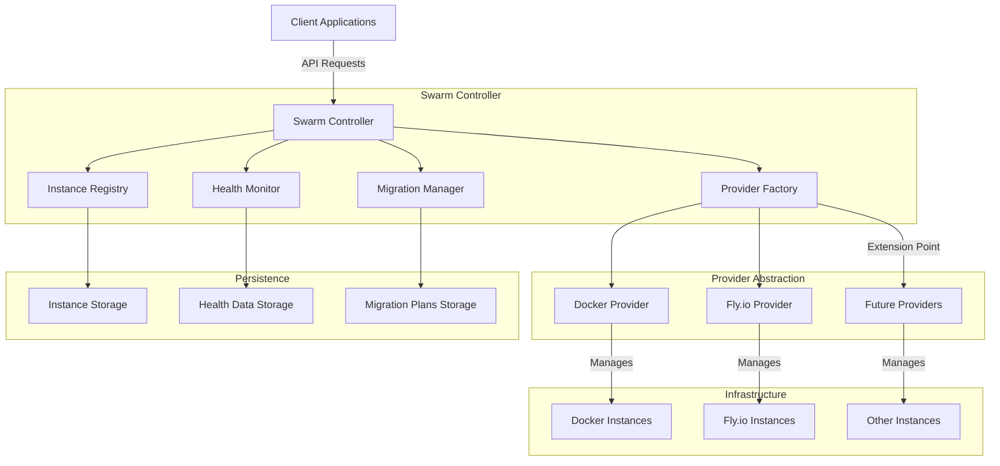

### 1.2 Key Components

| Component | Description |
|-----------|-------------|
| **Swarm Controller** | Central orchestration component that manages the lifecycle of VSCode instances across providers |
| **Instance Registry** | Maintains a registry of all VSCode instances with their metadata and status |
| **Health Monitor** | Monitors the health of VSCode instances and provides recovery mechanisms |
| **Migration Manager** | Handles migration of VSCode instances between different providers |
| **Provider Abstraction** | Abstracts provider-specific implementation details behind a common interface |
| **Persistence Layer** | Stores instance data, health metrics, and migration plans for durability |

### 1.3 Communication Flows

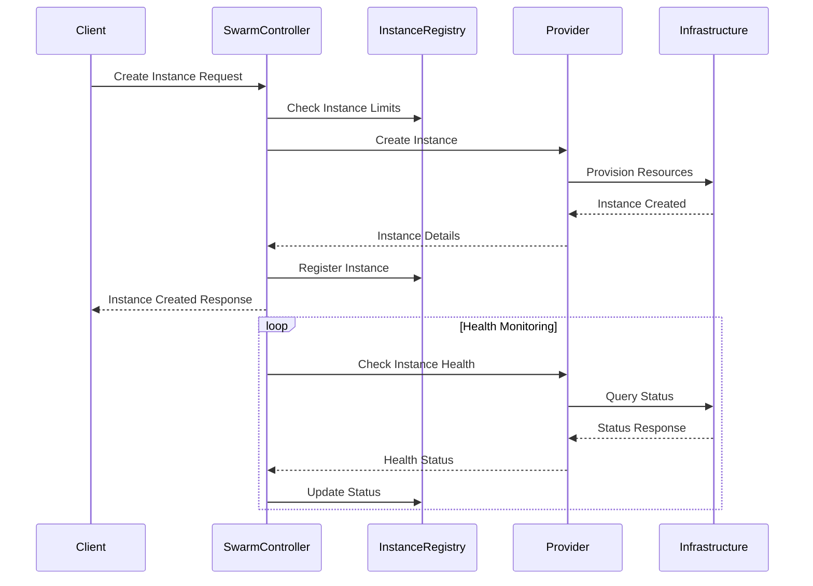

## 2. Swarm Controller Design

The Swarm Controller is the central orchestration component that manages the lifecycle of VSCode instances across different providers.

### 2.1 Core Responsibilities

- **Instance Lifecycle Management**: Create, start, stop, and delete VSCode instances
- **Provider Coordination**: Interact with different infrastructure providers through a unified interface
- **Health Monitoring**: Monitor instance health and trigger recovery actions when needed
- **Migration Orchestration**: Coordinate migration of instances between providers
- **Resource Optimization**: Distribute instances across providers based on resource availability and constraints

### 2.2 Interface Definitions

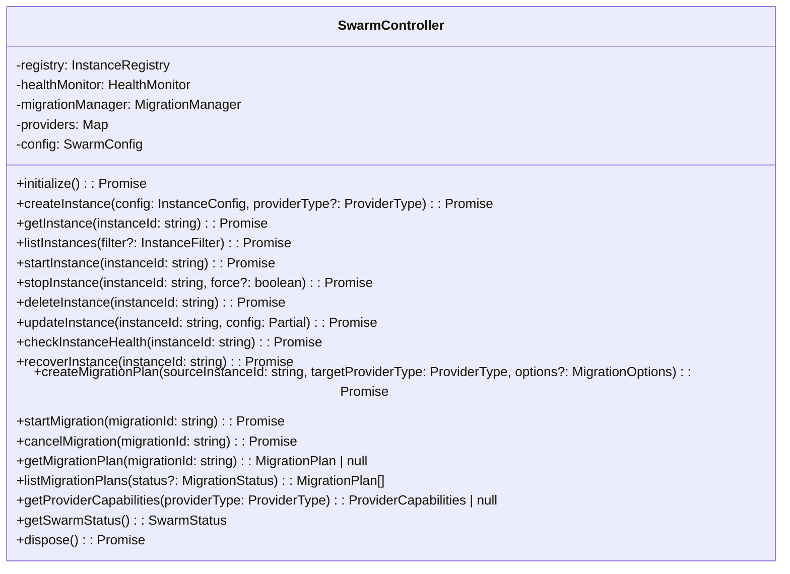

### 2.3 State Management Approach

The Swarm Controller maintains state through several mechanisms:

1. **In-Memory State**: Active instances, provider connections, and operational status
2. **Persistent State**: Instance configurations, health data, and migration plans stored on disk
3. **Distributed State**: Instance state maintained by providers and synchronized with the registry

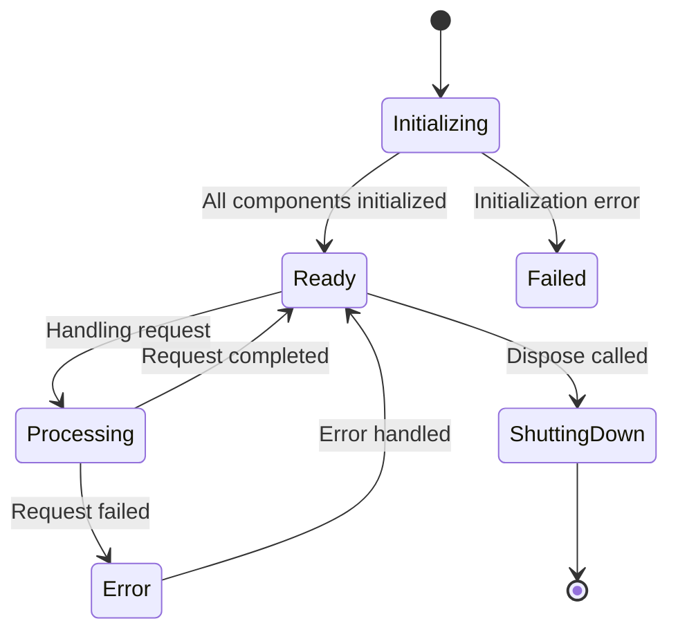

## 3. Provider Abstraction

The Provider Abstraction layer enables the Swarm Controller to interact with different infrastructure providers through a unified interface.

### 3.1 Provider Interface Design

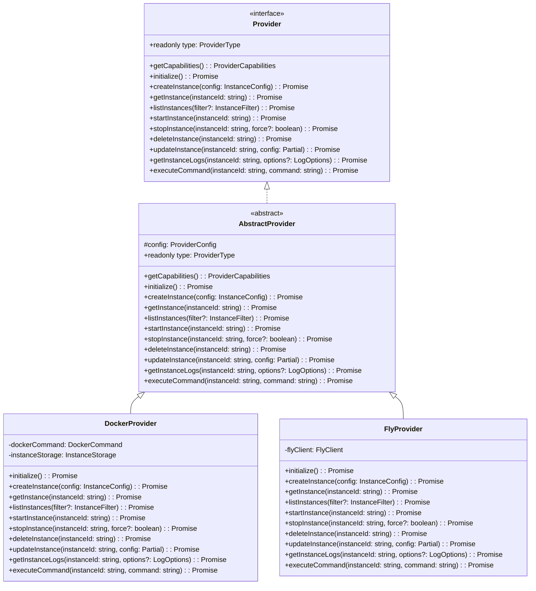

### 3.2 Docker Provider Implementation

The Docker Provider implements the Provider interface for Docker containers:

- **Container Management**: Creates, starts, stops, and deletes Docker containers
- **Resource Allocation**: Manages CPU, memory, and storage resources for containers
- **Network Configuration**: Sets up network connectivity for containers
- **Volume Mounting**: Mounts workspace volumes for persistent storage
- **Log Collection**: Collects container logs for monitoring and debugging

### 3.3 Fly.io Provider Implementation

The Fly.io Provider implements the Provider interface for Fly.io applications:

- **Application Deployment**: Deploys VSCode as Fly.io applications
- **Machine Management**: Manages Fly.io machines for VSCode instances
- **Volume Management**: Creates and attaches volumes for workspace storage
- **Network Configuration**: Sets up network connectivity and DNS
- **Scaling**: Handles scaling of Fly.io machines based on resource requirements

### 3.4 Extension Points for Future Providers

The Provider Abstraction layer is designed to be extensible, allowing for the addition of new providers:

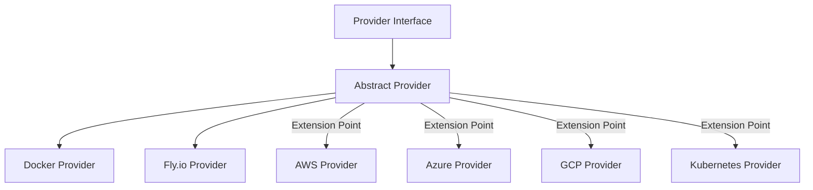

To implement a new provider:

1. Create a new provider class that extends AbstractProvider
2. Implement provider-specific logic for each method
3. Register the provider with the ProviderFactory
4. Add provider-specific configuration to the SwarmConfig

## 4. Instance Registry

The Instance Registry maintains a centralized registry of all VSCode instances across providers.

### 4.1 Data Model for Instances

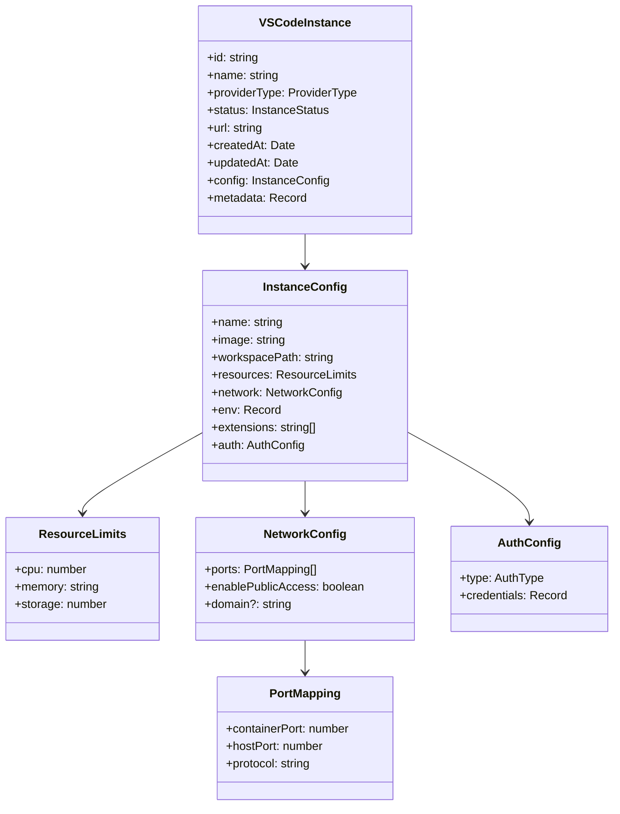

### 4.2 Persistence Strategy

The Instance Registry uses a file-based persistence strategy:

1. **Instance Files**: Each instance is stored as a JSON file in the instances directory
2. **Auto-Save**: Changes to instances are automatically saved to disk
3. **Load on Startup**: Instances are loaded from disk during initialization
4. **Atomic Updates**: File updates are performed atomically to prevent corruption

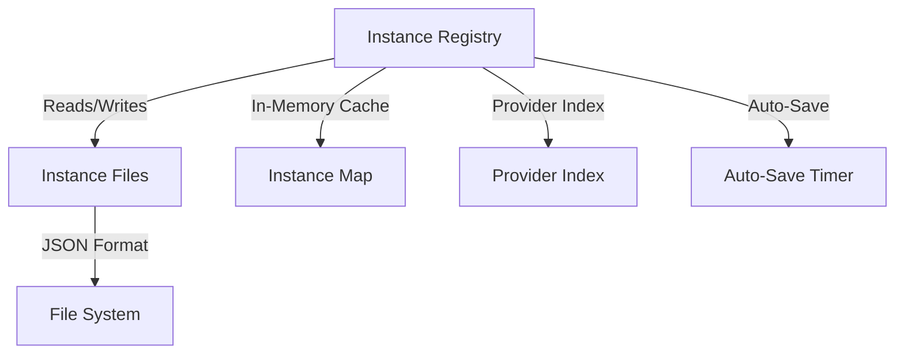

### 4.3 Query Capabilities

The Instance Registry provides several query capabilities:

- **Get by ID**: Retrieve an instance by its unique ID
- **List All**: List all instances in the registry
- **Filter by Provider**: List instances for a specific provider
- **Filter by Status**: List instances with a specific status
- **Search by Name**: Find instances matching a name pattern
- **Search by Metadata**: Find instances with specific metadata

## 5. Health Monitoring

The Health Monitor tracks the health of VSCode instances and provides recovery mechanisms.

### 5.1 Metrics Collection

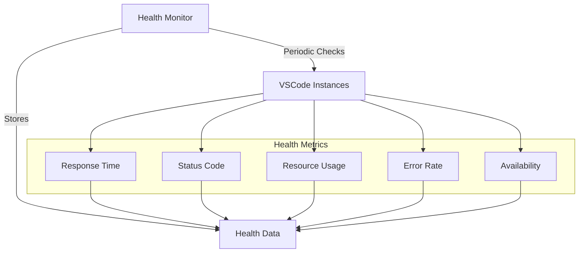

### 5.2 Health Status Determination

The Health Monitor determines instance health based on several factors:

1. **Instance Status**: Whether the instance is running according to the provider
2. **Response Time**: How quickly the instance responds to health checks
3. **Command Execution**: Whether the instance can execute simple commands
4. **Error Rate**: The frequency of errors reported by the instance
5. **Resource Usage**: CPU, memory, and storage usage

Health status is categorized as:

- **HEALTHY**: Instance is functioning normally
- **UNHEALTHY**: Instance is experiencing issues
- **RECOVERING**: Instance is being recovered
- **UNKNOWN**: Health status cannot be determined

### 5.3 Alerting Mechanisms

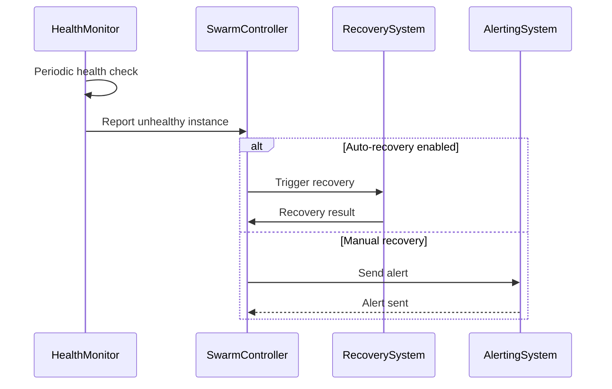

Alerting mechanisms include:

1. **Auto-Recovery**: Automatically attempt to recover unhealthy instances
2. **Status Updates**: Update instance status in the registry
3. **Logging**: Log health issues for later analysis
4. **External Notifications**: Integration points for external alerting systems

## 6. Migration Manager

The Migration Manager handles the migration of VSCode instances between different providers.

### 6.1 Migration Workflow

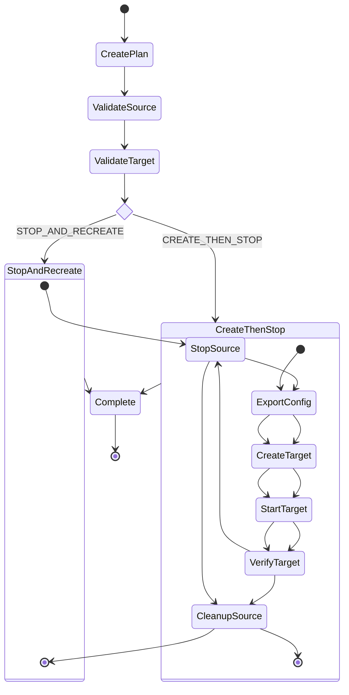

### 6.2 Data Persistence During Migration

During migration, several types of data need to be persisted:

1. **Instance Configuration**: The configuration of the source instance
2. **Workspace Data**: The user's workspace files and data
3. **Extension State**: Installed extensions and their configurations
4. **User Preferences**: User-specific settings and preferences
5. **Authentication State**: User authentication information

Persistence strategies include:

- **Volume Migration**: Moving or copying volumes between providers
- **Configuration Export/Import**: Exporting and importing configuration files
- **State Synchronization**: Synchronizing state between instances

### 6.3 Failure Handling

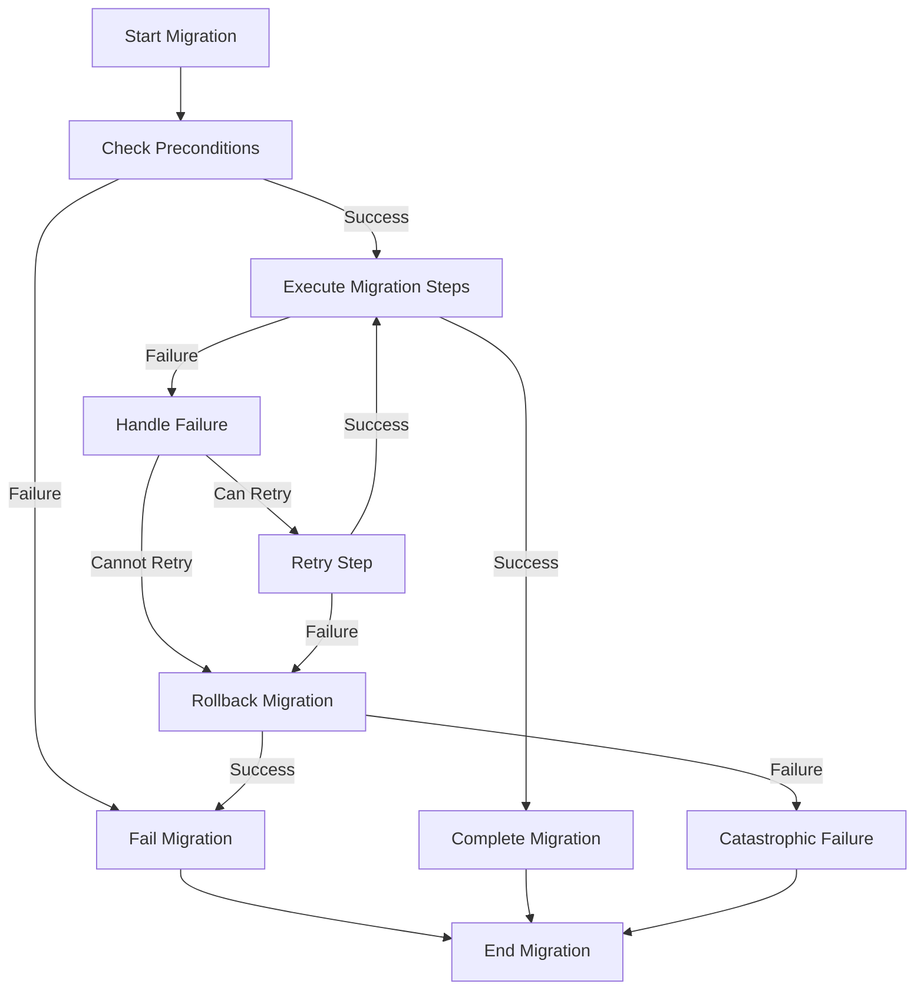

Failure handling mechanisms include:

1. **Step Retries**: Retry failed migration steps with exponential backoff
2. **Rollback**: Revert changes if migration fails
3. **Timeout Handling**: Handle migrations that exceed the timeout period
4. **Partial Success**: Handle cases where some steps succeed but others fail
5. **Manual Intervention**: Provide mechanisms for manual intervention

## 7. Security Considerations

### 7.1 Authentication and Authorization

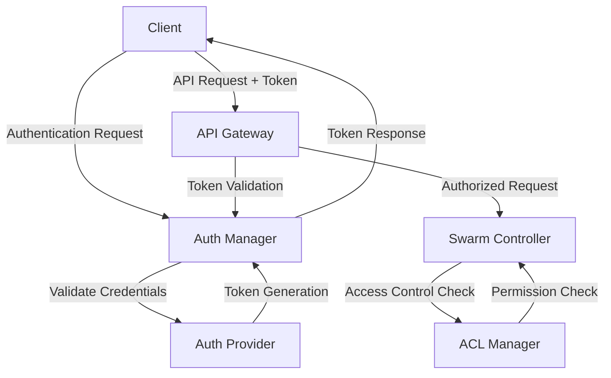

Authentication and authorization mechanisms include:

1. **Token-Based Authentication**: JWT or similar tokens for API authentication
2. **Role-Based Access Control**: Different roles with different permissions
3. **API Key Authentication**: API keys for programmatic access
4. **OAuth Integration**: Integration with OAuth providers for user authentication
5. **Multi-Factor Authentication**: Additional security for sensitive operations

### 7.2 Secure Communication Channels

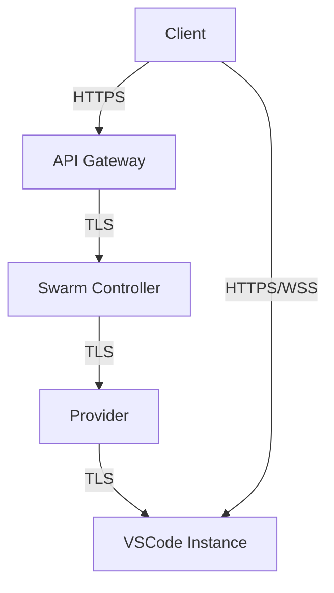

Secure communication mechanisms include:

1. **TLS Encryption**: All communication encrypted with TLS
2. **Certificate Validation**: Validation of server and client certificates
3. **Secure WebSockets**: WSS for real-time communication
4. **HTTP Security Headers**: Security headers for web interfaces
5. **Network Isolation**: Isolation of network traffic between instances

### 7.3 Secret Management

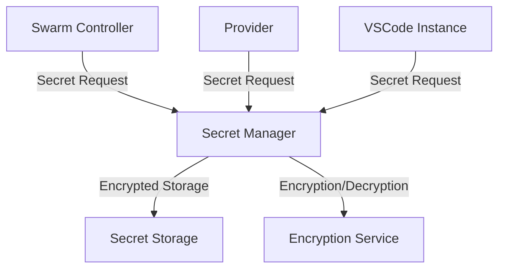

Secret management mechanisms include:

1. **Encrypted Storage**: Secrets stored in encrypted form
2. **Environment Variables**: Secrets passed to instances via environment variables
3. **Secret Rotation**: Regular rotation of secrets
4. **Least Privilege**: Minimal access to secrets
5. **Audit Logging**: Logging of secret access

## 8. Scalability Planning

### 8.1 Horizontal Scaling Approach

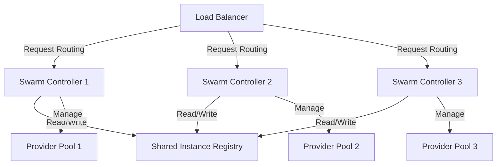

Horizontal scaling mechanisms include:

1. **Stateless Controllers**: Swarm Controllers designed to be stateless
2. **Shared Registry**: Centralized or distributed registry for instance data
3. **Load Balancing**: Distribution of requests across multiple controllers
4. **Provider Pools**: Grouping of providers for better resource utilization
5. **Sharding**: Partitioning of instance management by provider or region

### 8.2 Resource Optimization Strategies

Resource optimization strategies include:

1. **Instance Sizing**: Right-sizing instances based on workload
2. **Auto-Scaling**: Automatically scaling resources based on demand
3. **Resource Pooling**: Sharing resources across instances
4. **Idle Shutdown**: Shutting down idle instances to save resources
5. **Preemptible Instances**: Using preemptible or spot instances for cost savings

### 8.3 Performance Benchmarks

Performance benchmarks include:

1. **Instance Creation Time**: Time to create and start a new instance
2. **Migration Time**: Time to migrate an instance between providers
3. **Health Check Latency**: Time to perform a health check
4. **API Response Time**: Time to respond to API requests
5. **Resource Utilization**: CPU, memory, and storage utilization

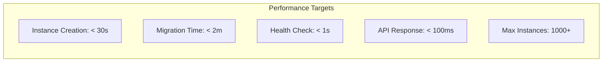

## Conclusion

The VSCode Remote Swarm architecture provides a robust and scalable platform for managing VSCode instances across multiple infrastructure providers. By leveraging a modular design with clear component boundaries and well-defined interfaces, the system can be extended and enhanced to support new providers and features.

Key strengths of the architecture include:

1. **Provider Abstraction**: Unified interface for different infrastructure providers
2. **Health Monitoring**: Proactive monitoring and recovery of instances
3. **Migration Capabilities**: Seamless migration between providers
4. **Scalability**: Designed for horizontal scaling and resource optimization
5. **Security**: Comprehensive security measures for authentication, communication, and secret management

Future enhancements could include:

1. **Additional Providers**: Support for more infrastructure providers
2. **Advanced Scheduling**: Intelligent placement of instances based on workload
3. **Cost Optimization**: Advanced cost optimization strategies
4. **Multi-Region Support**: Support for deploying instances across multiple regions
5. **Enhanced Observability**: More comprehensive monitoring and logging