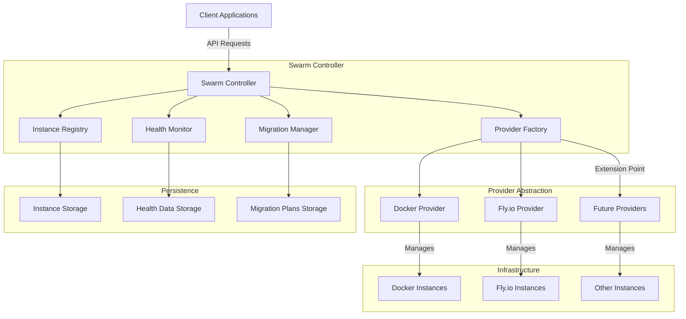
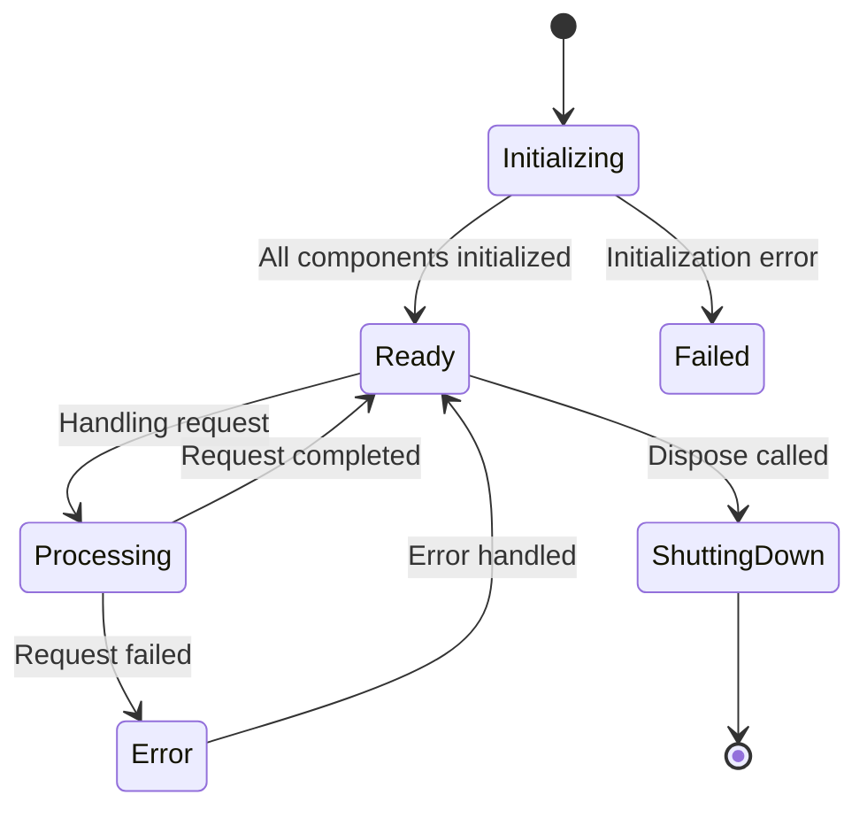
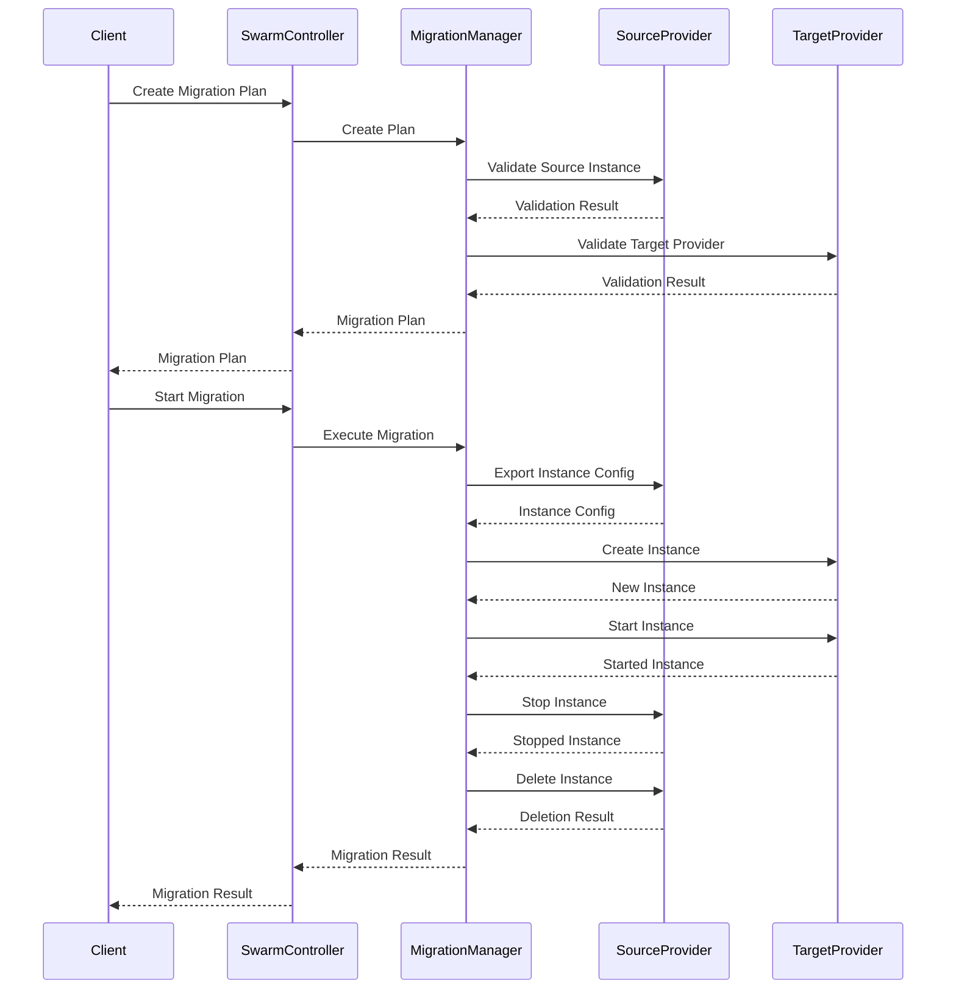

# Swarm Controller Implementation Plan

## 1. Swarm Controller Overview

### 1.1 Core Responsibilities

The Swarm Controller is the central orchestration component in the VSCode Remote Swarm architecture, responsible for managing the lifecycle of VSCode instances across multiple infrastructure providers. Its core responsibilities include:

- **Instance Lifecycle Management**: Creating, starting, stopping, and deleting VSCode instances
- **Provider Coordination**: Interacting with different infrastructure providers through a unified interface
- **Health Monitoring Integration**: Monitoring instance health and triggering recovery actions
- **Migration Orchestration**: Coordinating migration of instances between providers
- **Load Balancing**: Distributing instances across providers based on resource availability
- **State Management**: Maintaining consistent state across system components

The Swarm Controller acts as the primary entry point for client applications, providing a unified API for managing VSCode instances regardless of the underlying infrastructure provider.

### 1.2 Component Architecture

The Swarm Controller follows a modular architecture with clear separation of concerns:



Key components within the Swarm Controller:

1. **Core Controller**: Central coordination logic and API implementation
2. **Instance Registry**: Maintains a registry of all VSCode instances
3. **Health Monitor**: Monitors instance health and provides recovery mechanisms
4. **Migration Manager**: Handles migration of instances between providers
5. **Provider Factory**: Creates and manages provider instances
### 1.3 State Management Approach

The Swarm Controller employs a multi-layered state management approach:

1. **In-Memory State**: 
   - Active instances and their current status
   - Provider connections and capabilities
   - Operational status and metrics

2. **Persistent State**:
   - Instance configurations stored in JSON files
   - Health data persisted to disk
   - Migration plans saved for durability and recovery

3. **Distributed State**:
   - Instance state maintained by providers
   - Synchronized with the registry during operations
   - Eventual consistency model with periodic reconciliation

State transitions are handled through a well-defined lifecycle:



## 2. Implementation Steps

### 2.1 Provider Management and Abstraction

The Swarm Controller manages providers through the Provider Factory, which creates provider instances based on configuration:

```typescript
/**
 * Initialize providers based on configuration
 */
private async initializeProviders(): Promise<void> {
  try {
    logger.info('Initializing providers');
    
    // Initialize Docker provider if enabled
    if (this.config.providers.find(p => p.type === ProviderType.DOCKER && p.enabled)) {
      logger.info('Initializing Docker provider');
      
      try {
        const dockerProvider = ProviderFactory.createProvider(
          ProviderType.DOCKER,
          {
            common: {
              defaultResourceLimits: {
                cpu: 2,
                memory: '2048m',
                storage: 10
              },
              instanceNamePrefix: 'vscode-'
            },
            specific: this.config.providers.find(p => p.type === ProviderType.DOCKER)?.config || {}
          }
        );
        
        await dockerProvider.initialize();
        this.providers.set(ProviderType.DOCKER, dockerProvider);
        
        logger.info('Docker provider initialized');
      } catch (error) {
        logger.error('Failed to initialize Docker provider', error as Record<string, any>);
      }
    }
    
    // Initialize Fly.io provider if enabled
    if (this.config.providers.find(p => p.type === ProviderType.FLYIO && p.enabled)) {
      logger.info('Initializing Fly.io provider');
      
      try {
        const flyProvider = ProviderFactory.createProvider(
          ProviderType.FLYIO,
          {
            common: {
              defaultResourceLimits: {
                cpu: 1,
                memory: '1024m',
                storage: 5
              },
              instanceNamePrefix: 'vscode-'
            },
            specific: this.config.providers.find(p => p.type === ProviderType.FLYIO)?.config || {}
          }
        );
        
        await flyProvider.initialize();
        this.providers.set(ProviderType.FLYIO, flyProvider);
        
        logger.info('Fly.io provider initialized');
      } catch (error) {
        logger.error('Failed to initialize Fly.io provider', error as Record<string, any>);
      }
    }
    
    logger.info(`Initialized ${this.providers.size} providers`);
  } catch (error) {
    logger.error('Failed to initialize providers', error as Record<string, any>);
    throw error;
  }
}
```

Provider abstraction is achieved through a common interface that all providers must implement:

```typescript
/**
 * Provider interface
 */
export interface Provider {
  /**
   * Provider type
   */
  readonly type: ProviderType;
  
  /**
   * Get provider capabilities
   */
  getCapabilities(): ProviderCapabilities;
  
  /**
   * Initialize the provider
   */
  initialize(): Promise<void>;
  
  /**
   * Create a new VSCode instance
   */
  createInstance(config: InstanceConfig): Promise<VSCodeInstance>;
  
  /**
   * Get an instance by ID
   */
  getInstance(instanceId: string): Promise<VSCodeInstance | null>;
  
  /**
   * List instances
   */
  listInstances(filter?: InstanceFilter): Promise<VSCodeInstance[]>;
  
  /**
   * Start an instance
   */
  startInstance(instanceId: string): Promise<VSCodeInstance>;
  
  /**
   * Stop an instance
   */
  stopInstance(instanceId: string, force?: boolean): Promise<VSCodeInstance>;
  
  /**
   * Delete an instance
   */
  deleteInstance(instanceId: string): Promise<boolean>;
  
  /**
   * Update an instance
   */
  updateInstance(instanceId: string, config: Partial<InstanceConfig>): Promise<VSCodeInstance>;
  
  /**
   * Get instance logs
   */
  getInstanceLogs(instanceId: string, options?: LogOptions): Promise<InstanceLogs>;
  
  /**
   * Execute a command on an instance
   */
  executeCommand(instanceId: string, command: string): Promise<CommandResult>;
}
```
### 2.2 Instance Coordination

The Swarm Controller coordinates instance operations across providers:

```typescript
/**
 * Create a new VSCode instance
 */
public async createInstance(
  config: InstanceConfig,
  providerType?: ProviderType
): Promise<VSCodeInstance> {
  this.ensureInitialized();
  
  // Use default provider type if not specified
  const type = providerType || this.config.general.defaultProviderType;
  
  // Get provider
  const provider = this.providers.get(type);
  
  if (!provider) {
    throw new Error(`Provider ${type} not found or not initialized`);
  }
  
  // Create instance
  logger.info(`Creating instance with provider ${type}`);
  const instance = await provider.createInstance(config);
  
  // Register instance
  this.registry.registerInstance(instance);
  
  return instance;
}
```

Instance coordination involves:

1. **Provider Selection**: Selecting the appropriate provider based on configuration or request
2. **Operation Delegation**: Delegating operations to the selected provider
3. **State Synchronization**: Synchronizing instance state with the registry
4. **Error Handling**: Handling provider-specific errors and translating them to common error types

### 2.3 Health Monitoring Integration

The Swarm Controller integrates with the Health Monitor to track instance health:

```typescript
/**
 * Check instance health
 */
public async checkInstanceHealth(instanceId: string): Promise<InstanceHealth> {
  this.ensureInitialized();
  
  // Get instance
  const instance = this.registry.getInstance(instanceId);
  
  if (!instance) {
    throw new Error(`Instance ${instanceId} not found`);
  }
  
  // Check health
  await this.healthMonitor.checkInstanceHealth(instanceId);
  
  // Get health from registry or create a default one
  const health: InstanceHealth = {
    instanceId,
    status: HealthStatus.UNKNOWN,
    lastChecked: new Date(),
    details: {
      message: 'Health check initiated'
    },
    healthHistory: []
  };
  
  return health;
}
```

Health monitoring integration includes:

1. **Health Checks**: Periodic health checks of instances
2. **Status Updates**: Updating instance status based on health checks
3. **Recovery Actions**: Triggering recovery actions for unhealthy instances
4. **Health History**: Maintaining a history of health checks for analysis

### 2.4 Migration Orchestration

The Swarm Controller orchestrates instance migration between providers:

```typescript
/**
 * Create a migration plan
 */
public async createMigrationPlan(
  sourceInstanceId: string,
  targetProviderType: ProviderType,
  options?: MigrationOptions
): Promise<MigrationPlan> {
  this.ensureInitialized();
  
  // Get source instance
  const sourceInstance = this.registry.getInstance(sourceInstanceId);
  
  if (!sourceInstance) {
    throw new Error(`Source instance ${sourceInstanceId} not found`);
  }
  
  // Get target provider
  const targetProvider = this.providers.get(targetProviderType);
  
  if (!targetProvider) {
    throw new Error(`Target provider ${targetProviderType} not found or not initialized`);
  }
  
  // Create migration plan
  return this.migrationManager.createMigrationPlan(
    sourceInstanceId,
    targetProviderType,
    options
  );
}
```

Migration orchestration involves:

1. **Plan Creation**: Creating a migration plan with steps
2. **Execution**: Executing migration steps in sequence
3. **Monitoring**: Monitoring migration progress
4. **Rollback**: Rolling back migration if it fails
5. **Completion**: Finalizing migration and updating instance state

### 2.5 Load Balancing Strategy

The Swarm Controller implements load balancing through provider selection:

```typescript
/**
 * Select provider for new instance
 */
private selectProviderForInstance(config: InstanceConfig): ProviderType {
  // Get enabled providers
  const enabledProviders = this.config.providers
    .filter(p => p.enabled)
    .map(p => p.type);
  
  if (enabledProviders.length === 0) {
    throw new Error('No enabled providers available');
  }
  
  // If provider type is specified in config, use it
  if (config.providerType && enabledProviders.includes(config.providerType)) {
    return config.providerType;
  }
  
  // Get instance counts by provider
  const instanceCounts: Record<ProviderType, number> = {} as Record<ProviderType, number>;
  
  for (const type of enabledProviders) {
    instanceCounts[type] = this.registry.getInstanceCount(type);
  }
  
  // Select provider with fewest instances
  let selectedProvider = enabledProviders[0];
  let minCount = instanceCounts[selectedProvider] || 0;
  
  for (const type of enabledProviders) {
    const count = instanceCounts[type] || 0;
    if (count < minCount) {
      minCount = count;
      selectedProvider = type;
    }
  }
  
  return selectedProvider;
}
```

Load balancing strategies include:

1. **Least Instances**: Selecting the provider with the fewest instances
2. **Resource Availability**: Considering available resources on each provider
3. **Provider Capabilities**: Matching instance requirements with provider capabilities
4. **Geographic Distribution**: Distributing instances across regions
5. **Cost Optimization**: Considering cost factors in provider selection

## 3. API Design

### 3.1 Public API Methods

The Swarm Controller exposes a comprehensive API for managing VSCode instances:

```typescript
/**
 * Swarm controller class
 */
export class SwarmController {
  /**
   * Initialize the swarm controller
   */
  public async initialize(): Promise<void>;
  
  /**
   * Create a new VSCode instance
   */
  public async createInstance(
    config: InstanceConfig,
    providerType?: ProviderType
  ): Promise<VSCodeInstance>;
  
  /**
   * Get an instance by ID
   */
  public async getInstance(instanceId: string): Promise<VSCodeInstance | null>;
  
  /**
   * List all instances
   */
  public async listInstances(filter?: InstanceFilter): Promise<VSCodeInstance[]>;
  
  /**
   * Start an instance
   */
  public async startInstance(instanceId: string): Promise<VSCodeInstance>;
  
  /**
   * Stop an instance
   */
  public async stopInstance(instanceId: string, force?: boolean): Promise<VSCodeInstance>;
  
  /**
   * Delete an instance
   */
  public async deleteInstance(instanceId: string): Promise<boolean>;
  
  /**
   * Update instance configuration
   */
  public async updateInstance(
    instanceId: string,
    config: Partial<InstanceConfig>
  ): Promise<VSCodeInstance>;
  
  /**
   * Check instance health
   */
  public async checkInstanceHealth(instanceId: string): Promise<InstanceHealth>;
  
  /**
   * Recover an unhealthy instance
   */
  public async recoverInstance(instanceId: string): Promise<boolean>;
  
  /**
   * Create a migration plan
   */
  public async createMigrationPlan(
    sourceInstanceId: string,
    targetProviderType: ProviderType,
    options?: MigrationOptions
  ): Promise<MigrationPlan>;
  
  /**
   * Start a migration
   */
  public async startMigration(migrationId: string): Promise<MigrationResult>;
  
  /**
   * Cancel a migration
   */
  public async cancelMigration(migrationId: string): Promise<boolean>;
  
  /**
   * Get a migration plan
   */
  public getMigrationPlan(migrationId: string): MigrationPlan | null;
  
  /**
   * List migration plans
   */
  public listMigrationPlans(status?: MigrationStatus): MigrationPlan[];
  
  /**
   * Get provider capabilities
   */
  public getProviderCapabilities(providerType: ProviderType): ProviderCapabilities | null;
  
  /**
   * Get swarm status
   */
  public getSwarmStatus(): SwarmStatus;
  
  /**
   * Dispose of swarm controller resources
   */
  public async dispose(): Promise<void>;
}
```
### 3.2 Event System for Notifications

The Swarm Controller implements an event system for notifications:

```typescript
/**
 * Event types
 */
export enum SwarmEventType {
  INSTANCE_CREATED = 'instance_created',
  INSTANCE_STARTED = 'instance_started',
  INSTANCE_STOPPED = 'instance_stopped',
  INSTANCE_DELETED = 'instance_deleted',
  INSTANCE_UPDATED = 'instance_updated',
  INSTANCE_HEALTH_CHANGED = 'instance_health_changed',
  MIGRATION_CREATED = 'migration_created',
  MIGRATION_STARTED = 'migration_started',
  MIGRATION_COMPLETED = 'migration_completed',
  MIGRATION_FAILED = 'migration_failed',
  MIGRATION_CANCELLED = 'migration_cancelled',
  PROVIDER_ADDED = 'provider_added',
  PROVIDER_REMOVED = 'provider_removed',
  PROVIDER_UPDATED = 'provider_updated'
}

/**
 * Event data
 */
export interface SwarmEvent {
  type: SwarmEventType;
  timestamp: Date;
  data: any;
}

/**
 * Event listener
 */
export type SwarmEventListener = (event: SwarmEvent) => void;

/**
 * Event emitter
 */
private eventEmitter = new EventEmitter();

/**
 * Add event listener
 */
public addEventListener(type: SwarmEventType, listener: SwarmEventListener): void {
  this.eventEmitter.on(type, listener);
}

/**
 * Remove event listener
 */
public removeEventListener(type: SwarmEventType, listener: SwarmEventListener): void {
  this.eventEmitter.off(type, listener);
}

/**
 * Emit event
 */
private emitEvent(type: SwarmEventType, data: any): void {
  const event: SwarmEvent = {
    type,
    timestamp: new Date(),
    data
  };
  
  this.eventEmitter.emit(type, event);
}
```

### 3.3 Error Handling Patterns

The Swarm Controller implements comprehensive error handling:

```typescript
/**
 * Error types
 */
export enum SwarmErrorType {
  INITIALIZATION_ERROR = 'initialization_error',
  PROVIDER_ERROR = 'provider_error',
  INSTANCE_NOT_FOUND = 'instance_not_found',
  PROVIDER_NOT_FOUND = 'provider_not_found',
  MIGRATION_ERROR = 'migration_error',
  VALIDATION_ERROR = 'validation_error',
  PERMISSION_ERROR = 'permission_error',
  RESOURCE_LIMIT_ERROR = 'resource_limit_error',
  INTERNAL_ERROR = 'internal_error'
}

/**
 * Swarm error
 */
export class SwarmError extends Error {
  constructor(
    public readonly type: SwarmErrorType,
    message: string,
    public readonly cause?: Error
  ) {
    super(message);
    this.name = 'SwarmError';
  }
}

/**
 * Handle provider error
 */
private handleProviderError(error: Error, operation: string): SwarmError {
  logger.error(`Provider error during ${operation}`, error);
  
  return new SwarmError(
    SwarmErrorType.PROVIDER_ERROR,
    `Provider error during ${operation}: ${error.message}`,
    error
  );
}
```

Error handling patterns include:

1. **Error Types**: Well-defined error types for different failure scenarios
2. **Error Translation**: Translating provider-specific errors to common error types
3. **Error Propagation**: Propagating errors with context
4. **Error Recovery**: Recovering from errors when possible
5. **Error Logging**: Comprehensive logging of errors for debugging

### 3.4 Response Formats and Standardization

The Swarm Controller uses standardized response formats:

```typescript
/**
 * Standard response format
 */
export interface SwarmResponse<T> {
  success: boolean;
  data?: T;
  error?: {
    type: SwarmErrorType;
    message: string;
    details?: any;
  };
}

/**
 * Create success response
 */
private createSuccessResponse<T>(data: T): SwarmResponse<T> {
  return {
    success: true,
    data
  };
}

/**
 * Create error response
 */
private createErrorResponse<T>(error: SwarmError): SwarmResponse<T> {
  return {
    success: false,
    error: {
      type: error.type,
      message: error.message,
      details: error.cause ? { cause: error.cause.message } : undefined
    }
  };
}
```

Response standardization includes:

1. **Consistent Structure**: All responses follow a consistent structure
2. **Success Indicator**: Clear indication of success or failure
3. **Error Details**: Detailed error information for debugging
4. **Type Safety**: Type-safe responses using generics
5. **Pagination**: Standardized pagination for list responses

## 4. Provider Integration

### 4.1 Provider Registration Mechanism

The Swarm Controller registers providers during initialization:

```typescript
/**
 * Register provider
 */
public registerProvider(provider: Provider): void {
  this.ensureInitialized();
  
  // Check if provider is already registered
  if (this.providers.has(provider.type)) {
    throw new SwarmError(
      SwarmErrorType.VALIDATION_ERROR,
      `Provider ${provider.type} is already registered`
    );
  }
  
  // Register provider
  this.providers.set(provider.type, provider);
  
  // Emit event
  this.emitEvent(SwarmEventType.PROVIDER_ADDED, {
    providerType: provider.type,
    capabilities: provider.getCapabilities()
  });
  
  logger.info(`Provider ${provider.type} registered`);
}
```

Provider registration involves:

1. **Provider Validation**: Validating provider implementation
2. **Capability Discovery**: Discovering provider capabilities
3. **Configuration**: Configuring provider with settings
4. **Initialization**: Initializing provider
5. **Registration**: Adding provider to the registry
### 4.2 Provider Selection Algorithm

The Swarm Controller selects providers based on various factors:

```typescript
/**
 * Select best provider for instance
 */
private selectBestProvider(config: InstanceConfig): Provider {
  // Get enabled providers
  const enabledProviders = Array.from(this.providers.values())
    .filter(p => {
      const providerConfig = this.config.providers.find(pc => pc.type === p.type);
      return providerConfig && providerConfig.enabled;
    });
  
  if (enabledProviders.length === 0) {
    throw new SwarmError(
      SwarmErrorType.PROVIDER_NOT_FOUND,
      'No enabled providers available'
    );
  }
  
  // Filter providers by capabilities
  const capableProviders = enabledProviders.filter(p => {
    const capabilities = p.getCapabilities();
    
    // Check if provider can handle resource requirements
    if (config.resources) {
      if (config.resources.cpu > capabilities.maxCpu) return false;
      if (parseMemory(config.resources.memory) > parseMemory(capabilities.maxMemory)) return false;
      if (config.resources.storage > capabilities.maxStorage) return false;
    }
    
    // Check if provider has capacity
    if (capabilities.maxInstancesPerUser > 0) {
      const instanceCount = this.registry.getInstanceCount(p.type);
      if (instanceCount >= capabilities.maxInstancesPerUser) return false;
    }
    
    return true;
  });
  
  if (capableProviders.length === 0) {
    throw new SwarmError(
      SwarmErrorType.RESOURCE_LIMIT_ERROR,
      'No providers capable of handling resource requirements'
    );
  }
  
  // Score providers
  const providerScores = capableProviders.map(p => {
    const capabilities = p.getCapabilities();
    const instanceCount = this.registry.getInstanceCount(p.type);
    
    // Calculate score based on various factors
    let score = 0;
    
    // Factor 1: Available capacity
    if (capabilities.maxInstancesPerUser > 0) {
      score += (capabilities.maxInstancesPerUser - instanceCount) / capabilities.maxInstancesPerUser;
    } else {
      score += 1;
    }
    
    // Factor 2: Resource headroom
    if (config.resources) {
      score += (capabilities.maxCpu - config.resources.cpu) / capabilities.maxCpu;
      score += (parseMemory(capabilities.maxMemory) - parseMemory(config.resources.memory)) / parseMemory(capabilities.maxMemory);
      score += (capabilities.maxStorage - config.resources.storage) / capabilities.maxStorage;
    }
    
    // Factor 3: Provider priority from config
    const providerConfig = this.config.providers.find(pc => pc.type === p.type);
    if (providerConfig && providerConfig.priority) {
      score += providerConfig.priority;
    }
    
    return { provider: p, score };
  });
  
  // Select provider with highest score
  providerScores.sort((a, b) => b.score - a.score);
  return providerScores[0].provider;
}
```

Provider selection factors include:

1. **Resource Requirements**: Matching instance resource requirements with provider capabilities
2. **Available Capacity**: Considering available capacity on each provider
3. **Provider Priority**: Considering provider priority from configuration
4. **Geographic Location**: Considering geographic location requirements
5. **Cost Factors**: Considering cost factors in provider selection

### 4.3 Cross-Provider Operations

The Swarm Controller supports cross-provider operations through migration:



Cross-provider operations include:

1. **Migration**: Moving instances between providers
2. **Configuration Translation**: Translating configuration between providers
3. **State Transfer**: Transferring state between providers
4. **Coordination**: Coordinating operations across providers
5. **Rollback**: Rolling back operations if they fail

### 4.4 Fallback Strategies

The Swarm Controller implements fallback strategies for provider failures:

```typescript
/**
 * Create instance with fallback
 */
public async createInstanceWithFallback(config: InstanceConfig): Promise<VSCodeInstance> {
  this.ensureInitialized();
  
  // Get preferred provider type
  const preferredType = config.providerType || this.config.general.defaultProviderType;
  
  // Try preferred provider first
  try {
    return await this.createInstance(config, preferredType);
  } catch (error) {
    logger.warn(`Failed to create instance with preferred provider ${preferredType}`, error);
    
    // Get fallback providers
    const fallbackProviders = this.config.providers
      .filter(p => p.enabled && p.type !== preferredType)
      .map(p => p.type);
    
    // Try fallback providers
    for (const type of fallbackProviders) {
      try {
        logger.info(`Trying fallback provider ${type}`);
        return await this.createInstance(config, type);
      } catch (fallbackError) {
        logger.warn(`Failed to create instance with fallback provider ${type}`, fallbackError);
      }
    }
    
    // All providers failed
    throw new SwarmError(
      SwarmErrorType.PROVIDER_ERROR,
      'Failed to create instance with any provider'
    );
  }
}
```

Fallback strategies include:

1. **Provider Fallback**: Falling back to alternative providers if the preferred provider fails
2. **Operation Retry**: Retrying operations with exponential backoff
3. **Degraded Mode**: Operating in degraded mode if some providers are unavailable
4. **Circuit Breaking**: Preventing cascading failures with circuit breaking
5. **Health-Based Routing**: Routing operations to healthy providers

## 5. State Management

### 5.1 Swarm State Model

The Swarm Controller maintains a comprehensive state model:

```typescript
/**
 * Swarm state
 */
export interface SwarmState {
  /**
   * Whether the swarm is initialized
   */
  initialized: boolean;
  
  /**
   * Providers
   */
  providers: {
    /**
     * Provider type
     */
    type: ProviderType;
    
    /**
     * Whether the provider is enabled
     */
    enabled: boolean;
    
    /**
     * Provider capabilities
     */
    capabilities: ProviderCapabilities;
    
    /**
     * Number of instances for this provider
     */
    instanceCount: number;
  }[];
  
  /**
   * Instances
   */
  instances: {
    /**
     * Total number of instances
     */
    total: number;
    
    /**
     * Number of instances by status
     */
    byStatus: Record<InstanceStatus, number>;
    
    /**
     * Number of instances by provider
     */
    byProvider: Record<ProviderType, number>;
  };
  
  /**
   * Health
   */
  health: {
    /**
     * Whether health monitoring is enabled
     */
    enabled: boolean;
    
    /**
     * Number of instances by health status
     */
    byStatus: Record<HealthStatus, number>;
  };
  
  /**
   * Migrations
   */
  migrations: {
    /**
     * Whether migration is enabled
     */
    enabled: boolean;
    
    /**
     * Number of migrations by status
     */
    byStatus: Record<MigrationStatus, number>;
  };
}
```

The state model includes:

1. **Initialization State**: Whether the swarm is initialized
2. **Provider State**: State of each provider
3. **Instance State**: State of all instances
4. **Health State**: Health status of instances
5. **Migration State**: State of migrations
### 5.2 Persistence and Recovery

The Swarm Controller implements persistence and recovery mechanisms:

```typescript
/**
 * Save state to disk
 */
private async saveState(): Promise<void> {
  try {
    const state = this.getState();
    const statePath = path.join(this.config.general.stateDir, 'swarm-state.json');
    
    await fs.promises.mkdir(path.dirname(statePath), { recursive: true });
    await fs.promises.writeFile(statePath, JSON.stringify(state, null, 2), 'utf8');
    
    logger.debug('Swarm state saved to disk');
  } catch (error) {
    logger.error('Failed to save swarm state', error as Record<string, any>);
  }
}

/**
 * Load state from disk
 */
private async loadState(): Promise<void> {
  try {
    const statePath = path.join(this.config.general.stateDir, 'swarm-state.json');
    
    if (await fileExists(statePath)) {
      const data = await fs.promises.readFile(statePath, 'utf8');
      const state = JSON.parse(data) as SwarmState;
      
      // Apply state
      this.initialized = state.initialized;
      
      logger.debug('Swarm state loaded from disk');
    }
  } catch (error) {
    logger.error('Failed to load swarm state', error as Record<string, any>);
  }
}
```

Persistence and recovery mechanisms include:

1. **State Serialization**: Serializing state to JSON
2. **File-Based Storage**: Storing state in files
3. **Atomic Updates**: Using atomic file operations to prevent corruption
4. **Recovery**: Loading state during initialization
5. **Reconciliation**: Reconciling loaded state with actual state

### 5.3 Concurrency Handling

The Swarm Controller handles concurrency through locks and transactions:

```typescript
/**
 * Execute operation with lock
 */
private async withLock<T>(operation: string, callback: () => Promise<T>): Promise<T> {
  const lockId = `swarm-controller-${operation}-${Date.now()}`;
  
  try {
    await this.lockManager.acquire(lockId);
    logger.debug(`Acquired lock for operation: ${operation}`);
    
    return await callback();
  } finally {
    await this.lockManager.release(lockId);
    logger.debug(`Released lock for operation: ${operation}`);
  }
}

/**
 * Execute transaction
 */
private async executeTransaction<T>(
  operation: string,
  callback: () => Promise<T>
): Promise<T> {
  return this.withLock(operation, async () => {
    // Start transaction
    logger.debug(`Starting transaction: ${operation}`);
    
    try {
      // Execute callback
      const result = await callback();
      
      // Commit transaction
      logger.debug(`Committing transaction: ${operation}`);
      await this.saveState();
      
      return result;
    } catch (error) {
      // Rollback transaction
      logger.error(`Rolling back transaction: ${operation}`, error as Record<string, any>);
      
      throw error;
    }
  });
}
```

Concurrency handling mechanisms include:

1. **Locks**: Preventing concurrent access to shared resources
2. **Transactions**: Grouping operations into atomic transactions
3. **Optimistic Concurrency**: Using version numbers to detect conflicts
4. **Conflict Resolution**: Resolving conflicts when they occur
5. **Deadlock Prevention**: Preventing deadlocks through timeout mechanisms

### 5.4 Transaction-like Operations

The Swarm Controller implements transaction-like operations for consistency:

```typescript
/**
 * Create instance with transaction
 */
public async createInstanceWithTransaction(
  config: InstanceConfig,
  providerType?: ProviderType
): Promise<VSCodeInstance> {
  return this.executeTransaction('create-instance', async () => {
    // Validate config
    this.validateInstanceConfig(config);
    
    // Select provider
    const type = providerType || this.selectProviderForInstance(config);
    const provider = this.providers.get(type);
    
    if (!provider) {
      throw new SwarmError(
        SwarmErrorType.PROVIDER_NOT_FOUND,
        `Provider ${type} not found or not initialized`
      );
    }
    
    // Create instance
    logger.info(`Creating instance with provider ${type}`);
    const instance = await provider.createInstance(config);
    
    // Register instance
    this.registry.registerInstance(instance);
    
    // Emit event
    this.emitEvent(SwarmEventType.INSTANCE_CREATED, instance);
    
    return instance;
  });
}
```

Transaction-like operations include:

1. **Validation**: Validating inputs before execution
2. **Atomicity**: Ensuring operations are atomic
3. **Consistency**: Maintaining consistent state
4. **Isolation**: Isolating operations from each other
5. **Durability**: Ensuring changes are durable

## 6. Telemetry and Monitoring

### 6.1 Key Metrics Collection

The Swarm Controller collects key metrics for monitoring:

```typescript
/**
 * Collect metrics
 */
private collectMetrics(): SwarmMetrics {
  const metrics: SwarmMetrics = {
    timestamp: new Date(),
    providers: {},
    instances: {
      total: 0,
      byStatus: {},
      byProvider: {}
    },
    health: {
      byStatus: {}
    },
    migrations: {
      byStatus: {}
    },
    operations: {
      byType: {},
      latency: {}
    }
  };
  
  // Collect provider metrics
  for (const [type, provider] of this.providers.entries()) {
    const capabilities = provider.getCapabilities();
    const instanceCount = this.registry.getInstanceCount(type);
    
    metrics.providers[type] = {
      enabled: true,
      instanceCount,
      maxInstances: capabilities.maxInstancesPerUser,
      utilization: capabilities.maxInstancesPerUser > 0
        ? instanceCount / capabilities.maxInstancesPerUser
        : 0
    };
    
    metrics.instances.total += instanceCount;
    metrics.instances.byProvider[type] = instanceCount;
  }
  
  // Collect instance metrics
  for (const status of Object.values(InstanceStatus)) {
    const count = this.registry.getInstanceCountByStatus(status);
    metrics.instances.byStatus[status] = count;
  }
  
  // Collect health metrics
  for (const status of Object.values(HealthStatus)) {
    const count = this.healthMonitor.getInstanceCountByStatus(status);
    metrics.health.byStatus[status] = count;
  }
  
  // Collect migration metrics
  for (const status of Object.values(MigrationStatus)) {
    const count = this.migrationManager.listMigrationPlans(status).length;
    metrics.migrations.byStatus[status] = count;
  }
  
  // Collect operation metrics
  for (const [type, count] of this.operationCounts.entries()) {
    metrics.operations.byType[type] = count;
  }
  
  for (const [type, latencies] of this.operationLatencies.entries()) {
    if (latencies.length > 0) {
      const sum = latencies.reduce((a, b) => a + b, 0);
      metrics.operations.latency[type] = sum / latencies.length;
    }
  }
  
  return metrics;
}
```

Key metrics include:

1. **Provider Metrics**: Number of instances, utilization, etc.
2. **Instance Metrics**: Number of instances by status, provider, etc.
3. **Health Metrics**: Number of instances by health status
4. **Migration Metrics**: Number of migrations by status
5. **Operation Metrics**: Number of operations by type, latency, etc.

### 6.2 Performance Monitoring

The Swarm Controller monitors performance through metrics:

```typescript
/**
 * Start metrics collection
 */
private startMetricsCollection(): void {
  if (this.config.telemetry.enabled) {
    const interval = this.config.telemetry.collectionIntervalMs || 60000;
    
    this.metricsInterval = setInterval(() => {
      try {
        const metrics = this.collectMetrics();
        this.saveMetrics(metrics);
        
        // Emit metrics event
        this.emitEvent(SwarmEventType.METRICS_COLLECTED, metrics);
      } catch (error) {
        logger.error('Failed to collect metrics', error as Record<string, any>);
      }
    }, interval);
    
    logger.info(`Started metrics collection with interval ${interval}ms`);
  }
}

/**
 * Save metrics
 */
private async saveMetrics(metrics: SwarmMetrics): Promise<void> {
  try {
    const metricsDir = path.join(this.config.general.stateDir, 'metrics');
    await fs.promises.mkdir(metricsDir, { recursive: true });
    
    const timestamp = metrics.timestamp.toISOString().replace(/[:.]/g, '-');
    const metricsPath = path.join(metricsDir, `metrics-${timestamp}.json`);
    
    await fs.promises.writeFile(metricsPath, JSON.stringify(metrics, null, 2), 'utf8');
    
    // Cleanup old metrics files
    const files = await fs.promises.readdir(metricsDir);
    const maxFiles = this.config.telemetry.maxMetricsFiles || 100;
    
    if (files.length > maxFiles) {
      const sortedFiles = files
        .filter(file => file.startsWith('metrics-'))
        .sort();
      
      const filesToDelete = sortedFiles.slice(0, files.length - maxFiles);
      
      for (const file of filesToDelete) {
        await fs.promises.unlink(path.join(metricsDir, file));
      }
    }
  } catch (error) {
    logger.error('Failed to save metrics', error as Record<string, any>);
  }
}
```

Performance monitoring includes:

1. **Metrics Collection**: Collecting metrics at regular intervals
2. **Metrics Storage**: Storing metrics for later analysis
3. **Metrics Rotation**: Rotating metrics files to prevent disk space issues
4. **Metrics Aggregation**: Aggregating metrics for analysis
5. **Metrics Visualization**: Providing interfaces for visualizing metrics

### 6.3 Alerting Thresholds

The Swarm Controller implements alerting based on thresholds:

```typescript
/**
 * Check alerting thresholds
 */
private checkAlertingThresholds(metrics: SwarmMetrics): void {
  if (!this.config.alerting.enabled) return;
  
  // Check provider utilization
  for (const [type, providerMetrics] of Object.entries(metrics.providers)) {
    if (providerMetrics.maxInstances > 0 && providerMetrics.utilization > this.config.alerting.providerUtilizationThreshold) {
      this.emitEvent(SwarmEventType.ALERT, {
        type: 'provider_utilization',
        severity: 'warning',
        message: `Provider ${type} utilization is high: ${(providerMetrics.utilization * 100).toFixed(2)}%`,
        details: {
          providerType: type,
          utilization: providerMetrics.utilization,
          threshold: this.config.alerting.providerUtilizationThreshold
        }
      });
    }
  }
  
  // Check unhealthy instances
  const unhealthyCount = metrics.health.byStatus[HealthStatus.UNHEALTHY] || 0;
  const totalInstances = metrics.instances.total;
  
  if (totalInstances > 0 && unhealthyCount / totalInstances > this.config.alerting.unhealthyInstancesThreshold) {
    this.emitEvent(SwarmEventType.ALERT, {
      type: 'unhealthy_instances',
      severity: 'error',
      message: `High number of unhealthy instances: ${unhealthyCount} out of ${totalInstances}`,
      details: {
        unhealthyCount,
        totalInstances,
        percentage: unhealthyCount / totalInstances,
        threshold: this.config.alerting.unhealthyInstancesThreshold
      }
    });
  }
  
  // Check failed migrations
  const failedMigrations = metrics.migrations.byStatus[MigrationStatus.FAILED] || 0;
  const totalMigrations = Object.values(metrics.migrations.byStatus).reduce((a, b) => a + b, 0);
  
  if (totalMigrations > 0 && failedMigrations / totalMigrations > this.config.alerting.failedMigrationsThreshold) {
    this.emitEvent(SwarmEventType.ALERT, {
      type: 'failed_migrations',
      severity: 'error',
      message: `High number of failed migrations: ${failedMigrations} out of ${totalMigrations}`,
      details: {
        failedMigrations,
        totalMigrations,
        percentage: failedMigrations / totalMigrations,
        threshold: this.config.alerting.failedMigrationsThreshold
      }
    });
  }
}
```

Alerting thresholds include:

1. **Provider Utilization**: Alerting when provider utilization is high
2. **Unhealthy Instances**: Alerting when there are too many unhealthy instances
3. **Failed Migrations**: Alerting when there are too many failed migrations
4. **Operation Latency**: Alerting when operation latency is high
5. **Error Rate**: Alerting when error rate is high

### 6.4 Logging Strategy

The Swarm Controller implements a comprehensive logging strategy:

```typescript
/**
 * Configure logging
 */
private configureLogging(): void {
  // Configure logger
  logger.configure({
    level: this.config.logging.level || 'info',
    format: this.config.logging.format || 'json',
    destination: this.config.logging.destination || 'console',
    file: this.config.logging.file ? path.join(this.config.general.stateDir, this.config.logging.file) : undefined,
    maxFiles: this.config.logging.maxFiles || 10,
    maxSize: this.config.logging.maxSize || '10m'
  });
  
  // Log configuration
  logger.info('Swarm controller logging configured', {
    level: this.config.logging.level,
    format: this.config.logging.format,
    destination: this.config.logging.destination
  });
}
```

Logging strategy includes:

1. **Log Levels**: Different log levels for different types of messages
2. **Log Formats**: Structured logging formats for machine readability
3. **Log Destinations**: Multiple destinations for logs
4. **Log Rotation**: Rotating logs to prevent disk space issues
5. **Log Correlation**: Correlating logs across components

## 7. Testing Strategy

### 7.1 Unit Testing Approach

The Swarm Controller is designed for comprehensive unit testing:

```typescript
/**
 * Unit tests for Swarm Controller
 */
describe('SwarmController', () => {
  let controller: SwarmController;
  let mockRegistry: jest.Mocked<InstanceRegistry>;
  let mockHealthMonitor: jest.Mocked<HealthMonitor>;
  let mockMigrationManager: jest.Mocked<MigrationManager>;
  let mockProviders: Map<ProviderType, jest.Mocked<Provider>>;
  
  beforeEach(() => {
    // Create mocks
    mockRegistry = {
      initialize: jest.fn(),
      registerInstance: jest.fn(),
      getInstance: jest.fn(),
      listInstances: jest.fn(),
      removeInstance: jest.fn(),
      updateInstance: jest.fn(),
      getInstanceCount: jest.fn(),
      getInstanceCountByStatus: jest.fn(),
      dispose: jest.fn()
    } as unknown as jest.Mocked<InstanceRegistry>;
    
    mockHealthMonitor = {
      initialize: jest.fn(),
      checkInstanceHealth: jest.fn(),
      getInstanceHealth: jest.fn(),
      getInstanceCountByStatus: jest.fn(),
      dispose: jest.fn()
    } as unknown as jest.Mocked<HealthMonitor>;
    
    mockMigrationManager = {
      initialize: jest.fn(),
      createMigrationPlan: jest.fn(),
      startMigration: jest.fn(),
      cancelMigration: jest.fn(),
      getMigrationPlan: jest.fn(),
      listMigrationPlans: jest.fn(),
      dispose: jest.fn()
    } as unknown as jest.Mocked<MigrationManager>;
    
    mockProviders = new Map();
    
    // Create controller
    controller = new SwarmController({
      registry: mockRegistry,
      healthMonitor: mockHealthMonitor,
      migrationManager: mockMigrationManager,
      providers: mockProviders,
      config: {
        general: {
          stateDir: '/tmp/swarm-test',
          defaultProviderType: ProviderType.DOCKER
        },
        providers: [
          {
            type: ProviderType.DOCKER,
            enabled: true,
            config: {}
          }
        ],
        telemetry: {
          enabled: false
        },
        alerting: {
          enabled: false
        },
        logging: {
          level: 'error'
        }
      }
    });
  });
  
  describe('initialize', () => {
    it('should initialize all components', async () => {
      await controller.initialize();
      
      expect(mockRegistry.initialize).toHaveBeenCalled();
      expect(mockHealthMonitor.initialize).toHaveBeenCalled();
      expect(mockMigrationManager.initialize).toHaveBeenCalled();
    });
  });
  
  // More tests...
});
```

Unit testing approach includes:

1. **Component Mocking**: Mocking dependencies for isolation
2. **Test Coverage**: Comprehensive test coverage for all methods
3. **Edge Cases**: Testing edge cases and error conditions
4. **State Verification**: Verifying state changes
5. **Behavior Verification**: Verifying behavior through mocks

### 7.2 Integration Testing with Providers

Integration testing with providers ensures the Swarm Controller works correctly with actual providers:

```typescript
/**
 * Integration tests for Swarm Controller with providers
 */
describe('SwarmController Integration', () => {
  let controller: SwarmController;
  let registry: InstanceRegistry;
  let healthMonitor: HealthMonitor;
  let migrationManager: MigrationManager;
  let dockerProvider: DockerProvider;
  
  beforeAll(async () => {
    // Create real components
    registry = new InstanceRegistry({
      stateDir: '/tmp/swarm-integration-test/registry'
    });
    
    healthMonitor = new HealthMonitor(
      registry,
      {
        checkIntervalMs: 1000,
        stateDir: '/tmp/swarm-integration-test/health'
      }
    );
    
    dockerProvider = new DockerProvider({
      common: {
        defaultResourceLimits: {
          cpu: 1,
          memory: '1024m',
          storage: 5
        },
        instanceNamePrefix: 'vscode-test-'
      },
      specific: {
        socketPath: '/var/run/docker.sock',
        networkName: 'bridge',
        imageTag: 'latest'
      }
    });
    
    const providers = new Map<ProviderType, Provider>();
    providers.set(ProviderType.DOCKER, dockerProvider);
    
    migrationManager = new MigrationManager(
      registry,
      providers,
      {
        general: {
          stateDir: '/tmp/swarm-integration-test'
        },
        migration: {
          defaultStrategy: MigrationStrategy.STOP_AND_RECREATE,
          timeoutMs: 300000
        }
      }
    );
    
    // Create controller
    controller = new SwarmController({
      registry,
      healthMonitor,
      migrationManager,
      providers,
      config: {
        general: {
          stateDir: '/tmp/swarm-integration-test',
          defaultProviderType: ProviderType.DOCKER
        },
        providers: [
          {
            type: ProviderType.DOCKER,
            enabled: true,
            config: {}
          }
        ],
        telemetry: {
          enabled: false
        },
        alerting: {
          enabled: false
        },
        logging: {
          level: 'error'
        }
      }
    });
    
    // Initialize
    await controller.initialize();
  });
  
  afterAll(async () => {
    await controller.dispose();
  });
  
  it('should create and delete an instance', async () => {
    // Create instance
    const instance = await controller.createInstance({
      name: 'integration-test',
      image: 'codercom/code-server:latest',
      workspacePath: '/tmp/workspace',
      resources: {
        cpu: 1,
        memory: '512m',
        storage: 1
      },
      network: {
        ports: [
          {
            containerPort: 8080,
            hostPort: 0,
            protocol: 'tcp'
          }
        ],
        enablePublicAccess: false
      },
      env: {},
      extensions: [],
      auth: {
        type: 'password',
        credentials: {
          password: 'test-password'
        }
      }
    });
    
    expect(instance).toBeDefined();
    expect(instance.id).toBeDefined();
    expect(instance.status).toBe(InstanceStatus.CREATED);
    
    // Get instance
    const retrievedInstance = await controller.getInstance(instance.id);
    expect(retrievedInstance).toBeDefined();
    expect(retrievedInstance?.id).toBe(instance.id);
    
    // Delete instance
    const deleted = await controller.deleteInstance(instance.id);
    expect(deleted).toBe(true);
    
    // Verify instance is deleted
    const deletedInstance = await controller.getInstance(instance.id);
    expect(deletedInstance).toBeNull();
  });
  
  // More tests...
});
```

Integration testing includes:

1. **Real Components**: Using real components instead of mocks
2. **End-to-End Workflows**: Testing complete workflows
3. **Provider Interaction**: Testing interaction with actual providers
4. **Resource Management**: Testing resource management
5. **Cleanup**: Proper cleanup after tests

### 7.3 Stress and Load Testing

Stress and load testing ensures the Swarm Controller can handle high loads:

```typescript
/**
 * Stress and load tests for Swarm Controller
 */
describe('SwarmController Stress', () => {
  let controller: SwarmController;
  
  beforeAll(async () => {
    // Create controller with real components
    // ...
    
    // Initialize
    await controller.initialize();
  });
  
  afterAll(async () => {
    await controller.dispose();
  });
  
  it('should handle creating many instances concurrently', async () => {
    const instanceCount = 10;
    const promises: Promise<VSCodeInstance>[] = [];
    
    // Create instances concurrently
    for (let i = 0; i < instanceCount; i++) {
      promises.push(controller.createInstance({
        name: `stress-test-${i}`,
        image: 'codercom/code-server:latest',
        workspacePath: `/tmp/workspace-${i}`,
        resources: {
          cpu: 0.1,
          memory: '128m',
          storage: 0.5
        },
        network: {
          ports: [
            {
              containerPort: 8080,
              hostPort: 0,
              protocol: 'tcp'
            }
          ],
          enablePublicAccess: false
        },
        env: {},
        extensions: [],
        auth: {
          type: 'password',
          credentials: {
            password: 'test-password'
          }
        }
      }));
    }
    
    // Wait for all instances to be created
    const instances = await Promise.all(promises);
    expect(instances.length).toBe(instanceCount);
    
    // Verify all instances are created
    const allInstances = await controller.listInstances();
    expect(allInstances.length).toBeGreaterThanOrEqual(instanceCount);
    
    // Delete all instances
    for (const instance of instances) {
      await controller.deleteInstance(instance.id);
    }
  });
  
  // More tests...
});
```

Stress and load testing includes:

1. **Concurrent Operations**: Testing concurrent operations
2. **Resource Limits**: Testing behavior under resource constraints
3. **Long-Running Tests**: Testing behavior over extended periods
4. **Performance Metrics**: Collecting performance metrics
5. **Failure Injection**: Injecting failures to test resilience

### 7.4 Failure Scenario Testing

Failure scenario testing ensures the Swarm Controller can handle failures:

```typescript
/**
 * Failure scenario tests for Swarm Controller
 */
describe('SwarmController Failure', () => {
  let controller: SwarmController;
  let mockDockerProvider: jest.Mocked<Provider>;
  
  beforeEach(() => {
    // Create mocks
    // ...
    
    // Create controller
    // ...
  });
  
  it('should handle provider failure during instance creation', async () => {
    // Mock provider to fail
    mockDockerProvider.createInstance.mockRejectedValue(new Error('Provider failure'));
    
    // Try to create instance
    await expect(controller.createInstance({
      name: 'failure-test',
      image: 'codercom/code-server:latest',
      workspacePath: '/tmp/workspace',
      resources: {
        cpu: 1,
        memory: '512m',
        storage: 1
      },
      network: {
        ports: [
          {
            containerPort: 8080,
            hostPort: 0,
            protocol: 'tcp'
          }
        ],
        enablePublicAccess: false
      },
      env: {},
      extensions: [],
      auth: {
        type: 'password',
        credentials: {
          password: 'test-password'
        }
      }
    })).rejects.toThrow('Provider failure');
    
    // Verify no instance was registered
    expect(mockRegistry.registerInstance).not.toHaveBeenCalled();
  });
  
  it('should handle provider failure during instance deletion', async () => {
    // Mock instance
    const mockInstance: VSCodeInstance = {
      id: 'test-instance',
      name: 'test-instance',
      providerType: ProviderType.DOCKER,
      status: InstanceStatus.RUNNING,
      url: 'http://localhost:8080',
      createdAt: new Date(),
      updatedAt: new Date(),
      config: {
        name: 'test-instance',
        image: 'codercom/code-server:latest',
        workspacePath: '/tmp/workspace',
        resources: {
          cpu: 1,
          memory: '512m',
          storage: 1
        },
        network: {
          ports: [
            {
              containerPort: 8080,
              hostPort: 8080,
              protocol: 'tcp'
            }
          ],
          enablePublicAccess: false
        },
        env: {},
        extensions: [],
        auth: {
          type: 'password',
          credentials: {
            password: 'test-password'
          }
        }
      },
      metadata: {}
    };
    
    // Mock registry to return instance
    mockRegistry.getInstance.mockResolvedValue(mockInstance);
    
    // Mock provider to fail
    mockDockerProvider.deleteInstance.mockRejectedValue(new Error('Provider failure'));
    
    // Try to delete instance
    await expect(controller.deleteInstance('test-instance')).rejects.toThrow('Provider failure');
    
    // Verify instance was not removed from registry
    expect(mockRegistry.removeInstance).not.toHaveBeenCalled();
  });
  
  // More tests...
});
```

Failure scenario testing includes:

1. **Provider Failures**: Testing provider failures
2. **Network Failures**: Testing network failures
3. **Resource Exhaustion**: Testing resource exhaustion
4. **Partial Failures**: Testing partial failures
5. **Recovery**: Testing recovery from failures

## Conclusion

The Swarm Controller is the central orchestration component of the VSCode Remote Swarm architecture, responsible for managing VSCode instances across multiple infrastructure providers. It provides a unified API for instance lifecycle management, health monitoring, migration, and more.

The implementation plan outlined in this document provides a comprehensive approach to building the Swarm Controller, covering all aspects from core responsibilities to testing strategies. By following this plan, the Swarm Controller will be robust, scalable, and maintainable.

Key workflows such as instance creation, migration, and health monitoring are designed with reliability and performance in mind, ensuring the Swarm Controller can handle the demands of a production environment. The modular architecture allows for easy extension with new providers and features in the future.